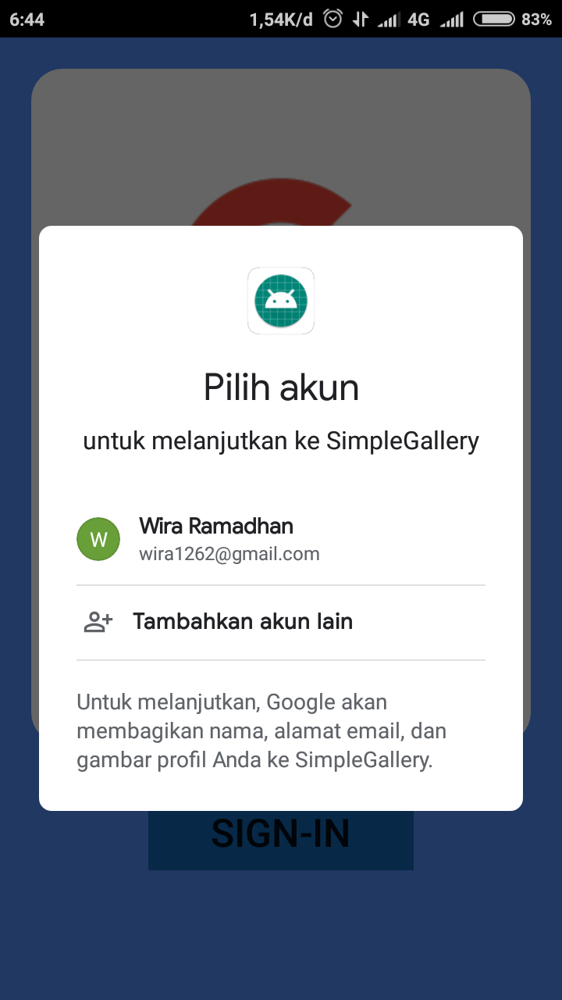

# DocPhotoToDrive
a simple gallery and camera that stores to your GDrive Account App

# WhoseFace (TFLite Face Recognize)

About Whose Face.

Doc Photo To Drive is a simple app project to store your document photo quickly to drive
it is initially for user that happen to be forgotful, this app is simply take picture and take it to your drive
you name it, your family certificate, citizenship card, passport that very important

This work of app is supported using AndroidX library at the moment, support from SDK 21 until 30 (i guess, i have not tried it)
this Work use Drive API v3
https://developers.google.com/drive/api/v3/reference

Doc Photo To Drive  (V beforeAlpha)

About BadCode.

BadCode is just a developer name for me to name the app study.
BadCode is obtained through sloppy design and lack of maintainability of the code.
the code of the app complexity should limited to low and medium.
Each of app is developed on purposed to be developed/combined into other functionality

Mainly for personal research,
may publish the app publicly if i feel it hehe . . .

Cheers ...

# How to operate

How to operate:

Always sign in First, just like any other app that use integrated google sign in

<body>
  

  
  

  
  
  
  
  
  </body>
